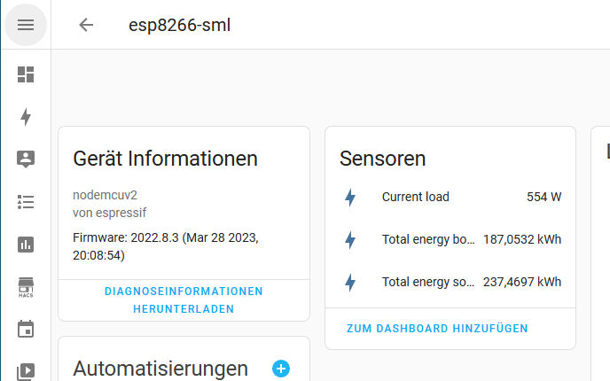

# ESPHome-SML-Hichi-IR
ESPHome configuration example to read Power Meter via IR TTL (Hichi EHZ Volkszähler)

I'm using an ESP8266 NodeMCU and the Hichi IR TTL reader connected to GPIO3 (RX)

This configuration works for me with my Iskra (Iskraemeco) MT631

If needed change your obis_code accordingly to your Power Meters provided values.

To see which obis_code's are sent from your power meter, you can simply set the log level for sml to DEBUG.

# Device view in Home Assistant

